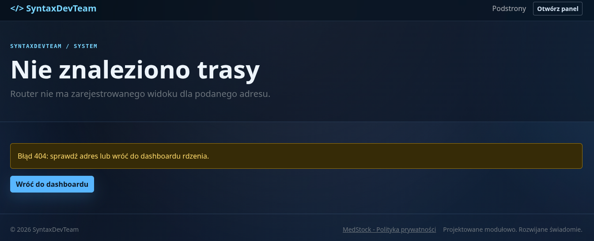
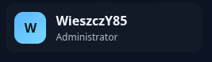
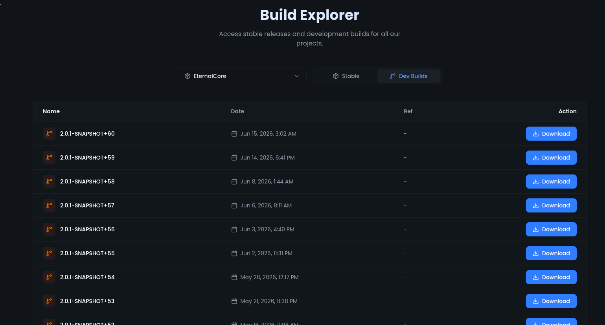

# Wynik testów - obserwacje

## System modułów
1. Usunięto z działającego panelu martwą sekcję `Wzorce UI`, trasę
   `/admin/design-system` i globalny przycisk `Admin stylebook`; prototypy pozostają
   materiałem developerskim w `templates/`. (gotowe)
2. Role systemowe tworzą hierarchię Owner, Administrator, Maintainer, Redaktor,
   Audytor, Support i Użytkownik z ochroną ostatniego Ownera oraz blokadą eskalacji
   ról uprzywilejowanych. (gotowe)

3. ~~Obecnie głownym założeniem modulacji jest separacja pozwalajaca na "wrzuć -> zainstaluj -> używaj". Chciałbym aby moduły "Rozszerzenie" dodawały do sekcji ustawień rozszerzone możliwości ustawień dla linków. W tej chwili taką mozliwość ma wyłacznie "Dokumentacja" w dodatku z wyborem Menu głowne lub stopka (tylko na stronie głównej) bez opcji ustawienia nazwy/etykiety linku anie zaznaczenia obu tych elementów. To trzeba zmienić aby każdy z modułów "Rozszerzenie" posiadał taką implementację oraz w niej bardziej zaaawansowane opcje.~~ (gotowe)
4. ~~Możliwość eksportu do zip już zainstalowanych modułów "Rozszerzenie"~~ (gotowe)
5. Eksport i aktualizacja modułów chronionych: manager eksportuje także moduły
   `core` i `system`. Import wyższej wersji zachowuje tożsamość pakietu, wykonuje
   podmianę kodu wraz z kontrolowanymi migracjami i przy błędzie przywraca poprzednią
   wersję plików. Ochrona przed wyłączeniem i odinstalowaniem pozostaje aktywna. (gotowe)

## Szablony

Publiczny formularz logowania nie pokazuje technicznych nazw zabezpieczeń OAuth
(`state`, PKCE, rotacja sesji). Mechanizmy pozostają aktywne w Core, natomiast
interfejs ogranicza się do informacji potrzebnych użytkownikowi. (gotowe)

Branding SyntaxDevTeam korzysta z właściwego sygnetu w publicznej nawigacji,
panelu i formularzu logowania. Oba motywy mają favikony 16/32/48 px, wielorozmiarowe
ICO, Apple Touch Icon, ikony aplikacji 192/512 px, wariant maskowalny, manifest oraz
metadane Open Graph, Twitter Card i schema.org. Panel oraz prototypy developerskie
pozostają wyłączone z indeksowania. (gotowe)

Panel rozdziela teraz prosty branding od pełnych ustawień SEO i udostępniania:
bazowego URL, domyślnego tytułu, autora, robots, locale, obrazu social media wraz
z opisem, konta X/Twitter, koloru urządzenia i tokenów weryfikacyjnych. Publiczne
widoki generują canonical, Open Graph, Twitter Card oraz Organization/WebSite
JSON-LD, a błędy zawsze mają `noindex`. Szablony mają semantyczną stopkę, aktywną
pozycję nawigacji, większe cele dotykowe, mocny fokus i redukcję ruchu. (gotowe)

Panel korzysta z osobnego, przezroczystego sygnetu bez kwadratowego tła. Favikony
powstają z uproszczonego wariantu znaku, używają wygładzania wielopróbkowego i są
dostępne jako PNG 16-256 px oraz wielowarstwowe ICO. Logo publicznej strony
głównej pozostaje bez zmian. (gotowe)

Treść przycisków w publicznej nawigacji i tabelach panelu jest wyśrodkowana w obu
osiach. Linki i formularze akcji korzystają ze wspólnego kontenera flex, dzięki
czemu zachowują równą wysokość i linię bazową również po zwiększeniu celów
dotykowych do 44 px. (gotowe)

Czysta dystrybucja znajduje się w `install/cms`. Kreator `install.php` sprawdza
środowisko, konfiguruje stronę i OAuth, instaluje wybrane moduły w pustej bazie,
przygotowuje bezpieczny bootstrap pierwszego Ownera oraz generuje lokalne sekrety
bez ręcznej edycji plików.
Pakiet jest odtwarzany przez `bin/build-cms-distribution.php`. (gotowe)

Konfiguracja logowania nie wymaga już późniejszej edycji `.env`. Owner może w
Ustawieniach włączyć i skonfigurować GitHub, Discord, Google albo Microsoft;
sekrety trafiają do chronionego `config/modules/auth-providers.env` i nie są
odczytywane z powrotem do formularza. Instalator wymaga co najmniej jednego
dowolnego providera zamiast obowiązkowego GitHuba, a pierwsze poprawne logowanie
atomowo przejmuje rolę Ownera. (gotowe)

Menu panelu ma stabilne, rozszerzalne sekcje `Przestrzeń robocza`, `Core`,
`Treść`, `Narzędzia`, `Dedykowane` i `System`. Moduły mogą deklarować kolejne
sekcje bez zmian w motywie; użytkownicy i role należą do `Core`, natomiast
Translator YAML i Manager SQL do `Narzędzia`. (gotowe)

Sekcja strony głównej `Hero / Split` ma opcjonalne pole akrostychu. Wartość może
być wpisana ze spacjami lub po jednym wyrazie w linii; zapis normalizuje ją do
osobnych wierszy, a oba motywy subtelnie podświetlają pierwsze litery. Przykład
`SYSTEM YIELDING NEXT-GEN TOOLS APPS X-PLATFORM` tworzy pionowe `SYNTAX`. (gotowe)

Publiczna podstrona `/p/miniportal` opisuje funkcje, architekturę, bezpieczeństwo,
moduły, instalację i technologie miniPORTAL w formacie stron projektowych.
Podpis stopki linkuje `miniPORTAL` do tej podstrony, a `SyntaxDevTeam` do strony
głównej zespołu, bez powtarzania identycznego tekstu konfigurowalnej stopki. (gotowe)

Panel Ustawienia nie zestawia już krótkiego Brandingu bezpośrednio z wysokim SEO,
co tworzyło dużą pustą przestrzeń. Branding, Szablon i Cache są ułożone w lewym
stosie, SEO w prawej kolumnie, a publiczna nawigacja zajmuje pełną szerokość niżej.
Na węższym ekranie całość przechodzi do jednej kolumny. (gotowe)

Globalna wyszukiwarka panelu korzysta z indeksu Core, automatycznie obejmuje menu,
respektuje ACL oraz pozwala modułom zgłaszać dodatkowe akcje i słowa kluczowe.
Wyniki pojawiają się od dwóch znaków i obsługują klawiaturę. (gotowe)

Publiczna nawigacja modułów ma edytowalną kolejność; niższa liczba przesuwa link
wcześniej zarówno w menu głównym, jak i stopce. (gotowe)

Dashboard nie pokazuje już developerskiego panelu `Stan architektury`. Nowy
`DashboardRegistry` pozwala modułom dodawać metryki i tabele z ACL, obsługą błędu
danych i konfigurowalną widocznością. Projekty, Build Explorer i Team zgłaszają
pierwsze statystyki. (gotowe)

Formularz `/admin/team/create` został sprawdzony w sesji Ownera i zwraca 200.
Pobieranie listy użytkowników jest osłonięte, więc błąd repozytorium pokazuje stan
w panelu zamiast nieobsłużonego HTTP 500. (gotowe)

Korekta akrostychu: w Hero / Split zastępuje on główny nagłówek po lewej, pozostaje
semantycznym `h1`, a terminal `workspace status` po prawej jest zachowany. (gotowe)

Terminal Hero symuluje uruchomienie miniPORTAL i udostępnia prompt obsługiwany
klawiaturą. Komendy `help`, `status`, `ls`, `cd`, `login`, `projects`, `download`,
`wiki`, `team`, `about`, `whoami` i `clear` pokazują informacje albo prowadzą do
istniejących publicznych tras. Symulator działa wyłącznie w przeglądarce i nie ma
dostępu do powłoki ani systemu plików serwera. Wyniki startowe są wyróżnione
zielenią bez technicznego prefiksu `[ OK ]`, okno jest nieznacznie wyższe, a
powitanie identyfikuje `SyntaxDevTerminal 0.1.5`. (gotowe)

Typografia akrostychu nie rezerwuje osobnej kolumny dla pierwszych liter. Litera
wyróżniona kolorem pozostaje bezpośrednią częścią wyrazu, a ograniczona skala i
nierozdzielanie słów utrzymują stabilny układ hero obok terminala. (gotowe)

Nagłówki sekcji strony głównej można ręcznie dzielić Enterem w maksymalnie czterech
wierszach. Wszystkie motywy renderują podział jako kontrolowane ` `, nadal
kodują treść przed HTML i pozostawiają etykiety menu w jednej linii. (gotowe)

Alternatywny motyw `Future` przenosi lubiany wygląd z
`inspiration_sources/oldcms`: grafitową siatkę, cyan/lime/magenta, neonowe linie,
zwarte panele, duży hero i proste karty. Implementacja korzysta z aktualnego
`ThemeInterface`, więc obejmuje stronę główną, podstrony, moduły, logowanie i panel,
bez uruchamiania jakiegokolwiek kodu starego CMS-a. Motyw jest dostępny w
Ustawieniach oraz kreatorze czystej instalacji. (gotowe)

Szablon strony głównej a szablon pozostałych elementów to to 2 różne bajki zarówno dla menu i stopki co jest zgodne z założeniami i samą kwestią zawartości, jednakże pewne elelmenty powinny być współne:
1. ~~Nazwa strony~~ (gotowe)
2. ~~Stopka~~ (gotowe)
3. ~~Menu główne - część elementów dostępna wszedzie np.~~ (gotowe)
   -  ~~"Home" - strona główna, dostępna powinna być wszędzie po za samą stroną główną~~
   - ~~Linki do modułów ustawionych w panelu admina w "Ustawienia"~~
   - ~~Zaloguj/Panel~~ (gotowe)
   - ~~Kontakt - aby z każdego miejsca uzytkwonik mógł wejść i sprawdzić jak się skontaktować z zespołem.~~
4. ~~Panel admina -> Ustawienia i Dashboard - obecnie to szerokie na całą stronę ilości informacji z nie wielką doża realnych ustawień.~~ (gotowe - dodano responsywne siatki paneli)
   - ~~Brak możliwości edycji stopki - trzeba koniecznie to zmienić.~~ (gotowe)
   - ~~Szablon i branding można rozdzielic na dwa osobne elementy (będące responsywnie obok siebie w jednej lini)"Branding i SEO" oraz Szablon. Branding i SEO pozwalały na ustawienie więcej niż nazwy strony jej domyślny "nadtytuł" (czymkolwiek to jest) ale na realne wpisy w meta strony takiej jak słowa kluczowe, opis i całą resztę.~~ (gotowe)
   - ~~Wiele podobnych zabiegów można zrobić z informacjami o statusie ustawień gdzie nie ma możliwości konfiguracji z poziomu strony.~~ (gotowe w Dashboardzie i Ustawieniach)
   - ~~Porozrzucane przyciski funkcjonalne w panelach modułów.~~ (gotowe - główne akcje
     modułu trafiają do pełnoszerokiego paska pod nagłówkiem panelu)
5. Obsługa wszystkich stron błędu.
   - ~~Przykładowo obecnie brak ścieżki czy popularne 404 wygląda wizualnie jak niewiadomo jaki błąd a buton "Wróć do dashboardu" nie wiele mówi zwykłemu użytkownikowi~~ (publiczne 404/405 gotowe) 
   - Przyjazne strony błędów znacznei uatrakcyjnią samą stronę
6. Przyjazne linki  - mode_rewrite (gotowe)

## Dashboard
~~Więcej elementów statystyk i informacji o modułach, aktywności użytkowników itp. Dashboard musi byc centrum informacji o stronie gdzie padają decyzję co dalej 😉.~~ (gotowe)

## Przyszłę moduły i pomysły
### Widgety

Etap 1 gotowy: dodano moduł `widgets` 1.0.0 oparty na Hooks API. Panel
`/admin/widgets` zarządza terminalami i kartami, ich widocznością, kolejnością,
motywem oraz slotem strony głównej. Dotychczasowy terminal Hero jest rekordem
startowym modułu; motywy nie zawierają już bezwarunkowego terminala i mogą
zastąpić wspólny widget wpisem przypisanym do konkretnego motywu.

### Profil użytkownika

~~Obecnie istnieje jakaś namiastka w panelu admina o nazwie "Profil" gdzie występuej tylko "Połączone konta" całość można by zamknąć w osobnym module który by rozszerzał możliwości i przenosił opcje z "Profil" do menu po kliknięciu w nazwę użytkownika~~
 ~~gdzie możnaby utworzyć rozwijane menu z kilkoma opcjami takimi jak "Pokaż profil", "Edytuj dane", "Połączone konta", "Ustawienia avatara", "Bezpieczeństwo", "Wyloguj" itp.~~
 (gotowe: dropdown użytkownika, osobny moduł `user_profile`, widok profilu, edycja
 danych, ustawienia avatara, bezpieczeństwo i wejście do połączonych kont poza
 sidebarem; operacje OAuth pozostają w chronionym `core_auth`)

### Manager SQL
Prosty manager bazy danych al`a mikro-PHPMyAdmin pokazujący baze danych, tabele, kolumny, strukture i dane, przyciski akcji takie jak optymalizacja, wstaw, sql, export/import, usuwanie kolumna tabel, opróżnianie itd.

Korekta architektoniczna gotowa: Manager SQL jest osobnym modułem rozszerzenia
`database_manager`, a nie częścią `system_admin`. Moduł zachowuje adres
`/admin/database`, ma własny manifest, `install.sql` i tabelę historii operacji.

Etap 1 gotowy: bezpieczny podgląd read-only `/admin/database` pokazuje bazę,
listę tabel, rozmiary, przybliżoną liczbę wierszy oraz strukturę kolumn. Operacje
zapisu, SQL, import/export i akcje destrukcyjne wymagają kolejnych etapów z ACL,
CSRF, potwierdzeniami i audytem.

Etap 2 gotowy: widok wybranej tabeli pokazuje również dane rekordów w trybie
read-only z limitem 10-50 wierszy na stronę i prostą paginacją.

Etap 3 gotowy: wybraną tabelę można wyeksportować do CSV z limitem 10 000
rekordów, audytem operacji i neutralizacją formuł arkusza.

Etap 4 gotowy: wybraną tabelę można wyeksportować do pliku SQL zawierającego
`DROP TABLE IF EXISTS`, `CREATE TABLE` i paczkowane `INSERT`; SQL jest domyślnym
formatem eksportu, a CSV zostaje formatem pomocniczym.

Etap 5 gotowy: konsola `/admin/database/query` wykonuje pojedyncze zapytania
read-only `SELECT`, `SHOW`, `DESCRIBE`, `DESC` i `EXPLAIN` z CSRF, audytem oraz
limitem 100 wierszy wyniku.

Etap 6 gotowy: `/admin/database/history` pokazuje paginowaną historię operacji
zapisaną w tabeli `database_manager_history`, a główne akcje Managera SQL są
zebrane w górnym pasku modułu.

Etap 7 gotowy: Manager SQL nie jest już wyłącznie read-only. Dodano ACL
`database.manage`, operacje tabeli `OPTIMIZE`, `CHECK`, `ANALYZE`, `REPAIR`,
`TRUNCATE` i `DROP` z CSRF, audytem, historią i potwierdzeniem dla akcji
destrukcyjnych. Dodano też konsolę zapytań zapisowych z whitelistą pojedynczych
instrukcji i potwierdzeniem `WRITE`.

Etap 8 gotowy: dodano kontrolowany import SQL przez `/admin/database/import`.
Import przyjmuje plik `.sql` albo treść formularza, ma limit 2 MB, wymaga ACL
`database.manage`, CSRF, potwierdzenia `IMPORT`, audit logu i wpisu w historii modułu.

Etap 9 gotowy: dodano CRUD rekordów tabel. Manager SQL pozwala dodawać rekordy,
a dla tabel z dokładnie jednym kluczem głównym również edytować i usuwać wiersze.
Formularze są budowane z metadanych kolumn, korzystają z `Request`, CSRF, ACL
`database.manage`, audit logu i historii modułu.

### Translator pluginów
Autorska biblioteka MessageHandler używana w pluginach SyntaxDevTeam korzysta z plików YAML z wiadomościami na zasadzie kategoria, klucz, treść. Chciałbym mieć moduł który pozwoli na załadowanie pliku .yml z komputera przez formularz (lub przeciągnij/upuść) i otworzy przedzielony na pół ekran z treściką oryginalna i formlarzem dla utworzenia nowego pliku w którym wpisuję własną wersję tłumaczenia i zapis z weryfikacją parsera YAML (możliwie pomocne użycie biblioteki `/core/libs/Spyc.php`)

Etap 1 gotowy: dodano osobny moduł rozszerzenia `plugin_translator`. Panel
`/admin/plugin-translator` pozwala wkleić albo wgrać `.yml/.yaml`, waliduje YAML
przez `Spyc`, pokazuje oryginalne wiadomości oraz generuje formularz nowego
tłumaczenia. Eksport `/admin/plugin-translator/export` buduje `translation.yml`,
waliduje wynik przed pobraniem, wymaga CSRF i ACL `plugin_translator.use` oraz
zapisuje operacje do audit logu.

Etap 2 gotowy: translator ma publiczną stronę `/translations`, na której użytkownik
może wgrać albo wkleić YAML, uzupełnić tłumaczenie i zapisać je jako szkic lub
zgłoszenie gotowe do sprawdzenia. Dodano trwałą tabelę
`plugin_translation_submissions` z autorem, źródłem, wartościami tłumaczenia,
wygenerowanym YAML, postępem i statusem `draft`, `ready_for_review`, `approved`
albo `rejected`. Panel `/admin/plugin-translator` jest kolejką prac z podglądem
różnic, statusem ukończenia oraz akcjami zatwierdzenia, odrzucenia i pobrania YAML.

Etap 3 gotowy: formularz publiczny przyjmuje plik YAML przez pole
przeciągnij/upuść i wymaga wyboru języka docelowego z listy kodów `XX`. Edytor
pokazuje `Oryginał` i `Twoje tłumaczenie` w jednym oknie, linijka w linijkę, a
domyślny `Status zapisu` to `Kopia robocza`. Wprowadzanie i zapis wymagają
logowania; rozpoczęta praca jest zachowywana w sesji i wznawiana po logowaniu,
również dla kont oczekujących, które mogą tłumaczyć publicznie bez dostępu do
panelu admina. Liczniki używają określenia `linijki tekstu`, a przycisk `Sprawdź
formatowanie` pokazuje podgląd Minecraft legacy, RGB i MiniMessage bez zapisu.

Etap 4 gotowy: dodano widok `/translations/mine`, w którym zalogowany użytkownik
wraca do własnych szkiców, prac gotowych do sprawdzenia i odrzuconych zgłoszeń.
Kontynuacja edycji aktualizuje istniejący rekord zamiast tworzyć kolejne kopie, a
zatwierdzone tłumaczenia są zablokowane przed zmianą. Podgląd formatowania renderuje
wynik do HTML, pokazuje zmienne typu `<player>` jako zwykłe placeholdery i zgłasza
błędy MiniMessage, np. brak zamknięcia tagu lub błędny kolor HEX.

Etap 5 gotowy: translator jest także managerem zaakceptowanych plików językowych.
Dodano katalog `plugin_translation_projects`, przypisanie zgłoszeń do pluginu,
opcjonalną wersję pluginu oraz rozróżnienie pracy z edytora i gotowego uploadu.
Zalogowany użytkownik może przesłać ukończony YAML przez
`/translations/upload-ready`; plik trafia do kolejki `ready_for_review`, a po
akceptacji jest widoczny i możliwy do pobrania w publicznym katalogu pluginu.
Panel `/admin/plugin-translator/plugins` pozwala dodawać pluginy i zmieniać ich
widoczność, a główna kolejka pokazuje plugin, wersję i rodzaj zgłoszenia.

Etap 6 gotowy: formularz `Dodaj plugin` nie przechowuje opisu ani ręcznego URL.
Administrator wybiera opcjonalną, już opublikowaną stronę `core_pages`, np.
`/p/punisherx`. Katalog pokazuje powiązaną stronę i pozwala usunąć plugin bez
zgłoszeń. Główna kolejka managera ma bezpośrednie akcje `Zatwierdź`, `Odrzuć` i
`Usuń` obok podglądu oraz pobierania; akcje wymagają CSRF, potwierdzeń dla operacji
ryzykownych i zapisują audit log.

Etap 7 gotowy: pobierane tłumaczenia mają zawsze nazwę `messages_xx.yml`, gdzie
`xx` jest kodem języka, np. `messages_en.yml`, `messages_pl.yml` lub
`messages_de.yml`. Dotychczasowe `Narzędzie eksportu YAML` nazywa się teraz
`Edytor pliku YAML`; po wgraniu i edycji zapisuje wynik pod bezpieczną wersją
oryginalnej nazwy pliku zamiast stałego `translation.yml`.

Etap 8 gotowy: obszar `Pluginy translatora` nazywa się `Kategorie tłumaczeń`, bo
pozycja może reprezentować plugin, bota albo inny projekt. Każdą zwykłą kategorię
można edytować: zmienić nazwę, slug i powiązaną stronę. Usunięcie kategorii nie
kasuje prac użytkowników; w jednej transakcji przenosi zgłoszenia do chronionej
kategorii `Nieprzypisane`, a następnie usuwa wybraną pozycję.

Etap 9 gotowy: publiczne narzędzia translatora połączono w jedno centrum
`/translations` z zakładkami `Rozpocznij tłumaczenie`, `Moje wersje robocze` i
`Wyślij gotowy plik`. Katalog kategorii znajduje się pod nim na pełnej szerokości,
a nazwy kategorii są bezpośrednimi linkami zamiast osobnych przycisków pod tabelą.
Przy zaakceptowanych plikach dodano akcję `Zaproponuj poprawkę`, która otwiera
zawartość w edytorze jako nowy szkic bez modyfikowania zatwierdzonej wersji.

### Team
Moduł prezentacji listy członków drużyny z możliwością wejścia w publiczny profil użytkownika (zależność z z sekcją strony głównej `Kontakt`).

Etap 1 gotowy: dodano osobny moduł rozszerzenia `team`. Moduł ma tabelę
`team_members`, publiczną listę `/team`, publiczne profile `/team/member/{slug}`
oraz panel `/admin/team` do zarządzania widocznością, opisem, rolą, linkiem
kontaktowym i kolejnością członków zespołu. Profil publiczny jest powiązany z
lokalnym kontem użytkownika i korzysta z jego avatara. Dodano ogólny komponent
motywu `render_avatar()`.

### Wiki
Gotowe

### Build Explorer
(Nie mam dokładnie pomysłu) Moduł pozwalający na wyświetlenie listy plików do pobrania dla wszystkich dodanych projektów (współpraca z modułem Projekty) dla wersji Release/Snapshot/Dev/WIP Przykład ze strony innej ekipy 

Etap 1 gotowy: dodano osobny moduł `build_explorer` zależny od `projects`.
Każdy wpis należy do projektu i przechowuje wersję, kanał `Release`, `Snapshot`,
`Dev` albo `WIP`, nazwę pliku, zewnętrzny adres HTTPS, opcjonalny rozmiar i SHA-256,
opis zmian oraz stan publikacji. Publiczne `/builds` i
`/builds/project/{slug}` pokazują wyłącznie buildy opublikowanych projektów.
Panel `/admin/builds` udostępnia CRUD metadanych z ACL, CSRF i audit logiem.
Pierwszy etap celowo nie przyjmuje binarnych uploadów na serwer. Link `Pliki do
pobrania` jest domyślnie widoczny w menu głównym i pozostaje konfigurowalny w
ustawieniach nawigacji.

Etap 2 gotowy: panel przyjmuje bezpośredni upload `.jar` do chronionego katalogu
`cache/build-artifacts`. Rozmiar w bajtach i SHA-256 są obliczane po zapisie.
Domyślna nazwa powstaje jako
`<projekt>-<serwer>-<wersja>-<typ wersji>-<nr buildu>.jar`, np.
`PunisherX-Spigot-1.7.3-DEV-14c0e44.jar`, lecz pozostaje edytowalna. Publiczne
pobieranie przechodzi przez kontrolowaną trasę, która wymaga opublikowanego buildu
i projektu. Podmiana oraz usunięcie rekordu sprzątają poprzedni artefakt.

Etap 3 gotowy: `/builds` prowadzi kolejno przez projekt, kanał Release/Snapshot/
Dev/WIP, tabelę wersji i historię buildów. Tabela wersji pobiera zawsze najnowszy
build, a historia DEV/WIP pokazuje uruchomienia CI i ich commity. Endpoint
`POST /api/builds/ci/{slug-projektu}` przyjmuje JSON z GitHub Actions, weryfikuje
sekret z nagłówka i idempotentnie zapisuje artefakty według projektu, kanału,
platformy oraz ID joba. Release i Snapshot nie wymagają numeru buildu; rewizja
Snapshot może być częścią wersji, np. `1.7.3-R0.1`.

Etap 3.1 gotowy: endpoint CI przyjmuje także `multipart/form-data` z polem
`metadata` JSON i plikiem `artifact`. BuildExplorer zapisuje przesłany JAR w
`cache/build-artifacts`, wylicza rozmiar i SHA-256, opcjonalnie porównuje je z
danymi CI, publikuje rekord oraz przy ponownym wysłaniu tego samego ID joba
podmienia poprzedni lokalny artefakt. Dokumentacja zawiera gotowy przykład
GitHub Actions dla PunisherX.

Etap 3.2 gotowy: PunisherX jest opisany jako monorepo czterech osobno
publikowanych projektów BuildExplorera: `punisherx-paper`, `punisherx-spigot`,
`punisherx-bungeecord-bridge` i `punisherx-velocity-bridge`. Przykładowy workflow
GitHub Actions wykrywa dotknięte ścieżki, buduje tylko właściwą macierz produktów,
a zmiany wspólne Gradle/common publikują wszystkie cztery artefakty.

Etap 3.2.1 gotowy: przykład CI dopasowano do faktycznych katalogów repozytorium
PunisherX z gałęzi `experimental-spigot-version`: `punisherx-paper`,
`punisherx-spigot`, `bungee-bridge` i `velocity-bridge`. Dodano także
`.github/workflows/` do ścieżek wspólnych, aby pierwszy commit instalujący workflow
nie kończył publikacji jako `skipped`.

Etap 3.3 gotowy: historia buildów korzysta z komponentu szczegółów motywu bez
zagnieżdżonych kart i ma czytelniejsze odstępy przy tabeli commitów oraz przycisku
pobierania. Publiczne nagłówki Build Explorera pokazują pełniejszą ścieżkę
nawigacji. Endpoint CI rozróżnia brak sluga projektu od błędnego payloadu
`metadata`, a przykład PunisherX pobiera wersję z Gradle zamiast używać SHA
commita jako podstawowego numeru wersji.

Etap 3.4 gotowy: publiczne widoki Build Explorera renderują linkowany breadcrumb
`Build / Projekt / Kanał / Historia`, dzięki czemu można wrócić do listy buildów,
projektu albo kanału bez korzystania z przycisku wstecz przeglądarki.

Etap 3.5 gotowy: przykład CI PunisherX publikuje zacieniony, docelowy JAR zamiast
technicznego pliku bez zależności. Workflow preferuje artefakty `PunisherX-*.jar`,
wybiera największy kandydat i tworzy nazwę publikacji z faktycznego basename
artefaktu, np. `PunisherX-Paper-1.7.3-DEV-5.jar`, bez powielania sluga, platformy
ani kanału. Panel `/admin/builds` pokazuje teraz także rozmiar pliku w głównej
tabeli buildów.

Etap 3.6 gotowy: dodano gotowe workflowy GitHub Actions dla CleanerX Paper/Spigot
oraz pojedynczych pluginów GraveDiggerX, TagsX, PlotsX i EssentialsF. CleanerX
publikuje osobne projekty `cleanerx-paper` i `cleanerx-spigot`, a pozostałe
repozytoria korzystają z jednego parametrycznego workflowu z ustawianym slugiem,
platformą i prefiksem docelowego artefaktu.

### Projekty
(Taki pomysł ale trzeba mocno się zastanowić czy to ma sens przy już istniejacych modułach.) Moduł lub modyfikacja instniejących elementów CMSa gdzie można dodawać Projekty które są już publiczne lub w trakcie tworzenia, współpraca z podstonami (powiązanie) i modułem Wiki.

Etap 1 gotowy: osobny moduł `projects` pełni rolę katalogu agregującego, zamiast
powielać treści istniejących modułów. Przechowuje nazwę, slug, stan
`planowany` / `w trakcie tworzenia` / `wydany` / `wstrzymany`, kolejność i
publikację. Projekt może wskazywać istniejącą podstronę `core_pages` oraz projekt
`wikipedia`. Publiczne `/projects` i `/projects/{slug}` pokazują wyłącznie
opublikowane wpisy, a panel `/admin/projects` udostępnia pełny CRUD z ACL, CSRF i
audit logiem.
Link `Projekty` jest domyślnie widoczny w menu głównym i może zostać przeniesiony,
powielony w stopce albo ukryty przez ustawienia publicznej nawigacji.

Etap 2 gotowy: publiczny katalog układa jeden projekt na pełnej szerokości, dwa
i cztery w dwóch kolumnach, a trzy w trzech kolumnach. Karta nie duplikuje opisu;
prezentuje odnośniki do powiązanej strony, dokumentacji i Build Explorera.

### Econizer

Etap 11 gotowy: `econizer` 1.5.3 pokazuje ikonę serwera Discord na liście
zarządzanych serwerów oraz w szczególe serwera zapraszania bota. Jeśli Discord
nie zwraca ikony, aktywny motyw pokazuje czytelny fallback z inicjałami nazwy.

Etap 10 gotowy: `econizer` 1.5.2 usuwa zakładkę `Bot API` z ustawień
pojedynczego serwera Discord. Kontrakt endpointów bota jest teraz częścią panelu
platformowego `/admin/econizer` i jest widoczny tylko dla użytkownika z
uprawnieniem `econizer.platform.manage`, bo dotyczy właściciela bota oraz
globalnego tokenu `X-Econizer-Token`.

Etap 9 gotowy: `econizer` 1.5.1 poprawia publiczne tabele i wykres giełdy.
`Transaction history` oraz notowania rynku nie renderują już zagnieżdżonej karty
ani nie wymuszają niepotrzebnego poziomego przewijania na desktopie. Podpis
wykresu ceny ma własny układ i ograniczoną wysokość. Widok szczegółów serwera
pozwala ponownie zaprosić bota, jeśli tenant istnieje lokalnie, ale bot został
usunięty z serwera Discord.

Etap 8 gotowy: `econizer` 1.5.0 dzieli ustawienia serwera na zakładki Overview,
Shop i Market, aby ograniczyć przewijanie jednej długiej strony. Katalog
sklepu właściciela serwera jest teraz układem kart zamiast szerokiej tabeli,
typ realizacji dostał `virtual_item`, a role Discord i itemy wirtualne są
realizowane przez bota przez kolejkę zamówień: `GET /api/econizer/shop/orders`
i `POST /api/econizer/shop/orders/fulfill`. Zakładka giełdy pokazuje aktualne
ceny aktywów oraz ostatnie notowania.

Etap 7 gotowy: `econizer` 1.4.1 doprecyzowuje publiczny sklep jako adres
konkretnego serwera Discord: `/econizer/shop/{discord_guild_id}`. Ustawienia
serwera pokazują właścicielowi link do przekazania graczom, globalny sklep nie
wybiera już arbitralnie pierwszego tenanta przy wielu członkostwach, a onboarding
bota ma dwukolumnową listę serwerów, pełnoszerokie odświeżanie, krótszy komunikat
po zaproszeniu i czytelnie odstępione informacje techniczne.

Etap 6 gotowy: `econizer` 1.4.0 automatycznie przypisuje właściciela albo
administratora Discord do tenanta zgłoszonego przez bota. Odświeżenie listy
`/econizer/servers` przez dedykowany OAuth `identify guilds` wystarcza, aby konto
lokalne dostało rolę `guild_owner` albo `guild_admin` dla serwera, na którym
Discord potwierdza Owner, Administrator albo Manage Guild. Normalny przepływ nie
wymaga już ręcznego formularza `Link account` ani przypisywania osoby w panelu.

Etap 5 gotowy: pełny rebranding produkcyjny zmienił nazwę bota i modułu na
`Econizer`. Zaktualizowano widoki, treści CMS, dokumentację, klasy, katalog,
manifest, trasy, endpointy API, konfigurację środowiska, nagłówek integracyjny,
prefiksy tabel i nazwy assetów. Migracje `econizer` 1.3.1 oraz `core_pages` 1.3.1
zachowują istniejące dane, ustawienia instalacji i porządkują metadane schematu.

Etap 1 gotowy: dodano najbardziej rozbudowany moduł dedykowany projektu bota
ekonomicznego. `econizer` 1.0.0 obsługuje wiele serwerów Discord jako izolowane
tenanty. Owner miniPORTAL ustawia globalne funkcje, język PL, wartości startowe
ekonomii i limit Freemium; właściciel serwera konfiguruje walutę, podatek,
VIP daily, użytkowników, sklep i rynek; gracz widzi wyłącznie własny portfel,
postęp i historię. Sklep rozlicza zakup, stan magazynowy, zamówienie i historię
w jednej transakcji. Giełda przechowuje aktywa, notowania i udziały oraz rozlicza
kupno/sprzedaż z tym samym portfelem. Integracja bota używa osobnego tokenu i
idempotentnych identyfikatorów zdarzeń.

Etap 2 gotowy: panel nie tworzy już tenantów przez ręcznie wpisany Guild ID.
Osobny OAuth Discord pobiera serwery zarządzane przez bieżącego użytkownika,
odrzuca token po odpowiedzi i pokazuje kafelki Owner/Administrator/Manage Guild.
Szczegóły serwera udostępniają aktywację Freemium, kontrolę obecności bota oraz
przypięty link instalacji `bot applications.commands`. Diagnostyka konfiguracji
wyróżnia poprawne elementy zieloną ramką, a przy komplecie zwija się do paska.

Etap 3 gotowy: rozdzielono właściciela/administratora Discord od gracza serwera.
Lista zarządzanych serwerów działa w publicznym flow `/econizer/servers`, tenant
powstaje dopiero po zgłoszeniu bota do `/api/econizer/guilds`, a zweryfikowany
manager Discord tylko łączy konto z istniejącym tenantem i dopiero wtedy zarządza
ustawieniami per `discord_guild_id`. Sklep, giełda, portfele i historia pozostają
izolowane per serwer Discord.

Etap 4 gotowy: usunięto z ustawień serwera mylące pole `Powiąż użytkownika`.
Administrator serwera Discord nie wybiera dowolnych kont miniPORTAL; gracze są
przypisywani automatycznie po zdarzeniu bota, jeśli mają lokalną tożsamość Discord.
Panel `/admin/econizer` nie zawiera już flow zaproszenia bota, tylko diagnostykę
platformy i listę tenantów zgłoszonych przez bota.

Etap 10 gotowy: `econizer` 1.5.4 dodaje publiczny alias `/dashboard`
przekierowujący do `/econizer`. Kafle salda, poziomu i doświadczenia na pulpicie
gracza układają się na szerokich ekranach po trzy w jednej linii, a sekcja
`Quick actions` używa dwukolumnowej listy linków na desktopie.

### Ustawienia systemowe

Etap diagnostyki cache i favicon gotowy: licznik cache rozróżnia ważne i wygasłe
wpisy, pokazuje rozmiar, TTL i możliwość zapisu. Panel wyjaśnia, że cache powstaje
tylko przy anonimowych wejściach na obsługiwane publiczne widoki; sesja
administratora celowo go omija. Zapis ustawień Dashboardu nie czyści już cache.

Branding przyjmuje źródłowy PNG 512-4096 px i generuje favicony 16-256 px,
Apple Touch Icon, ikony aplikacji 192/512 px, wariant maskowalny, wielorozmiarowy
plik ICO oraz manifest. Pliki trafiają do chronionego przed wykonywaniem skryptów
`uploads/branding` i są współdzielone przez oba motywy.
